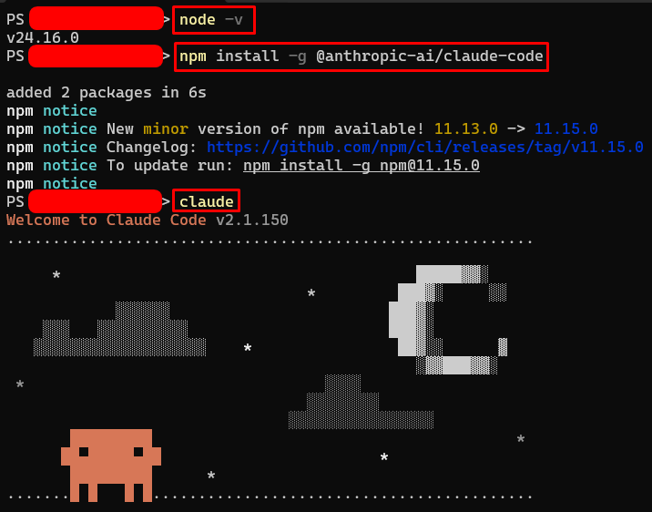
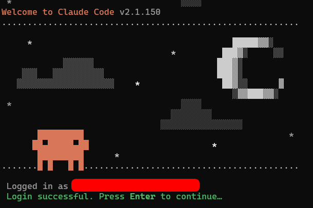
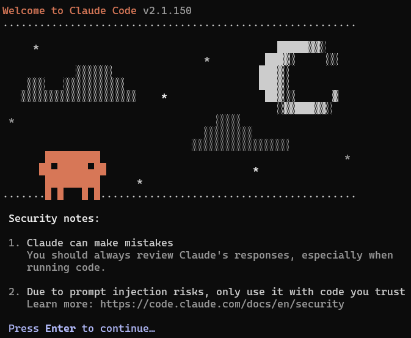
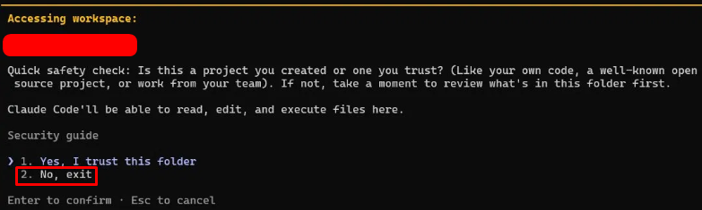
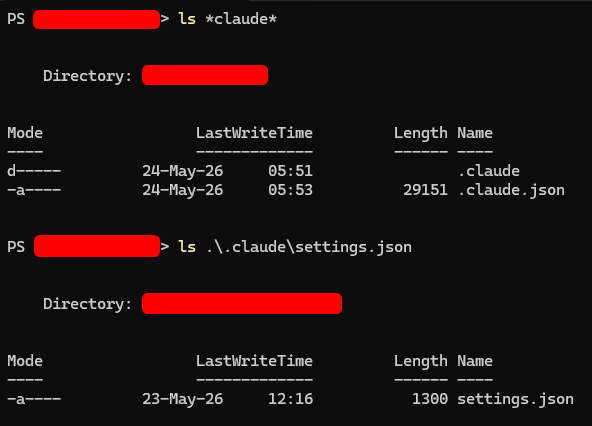
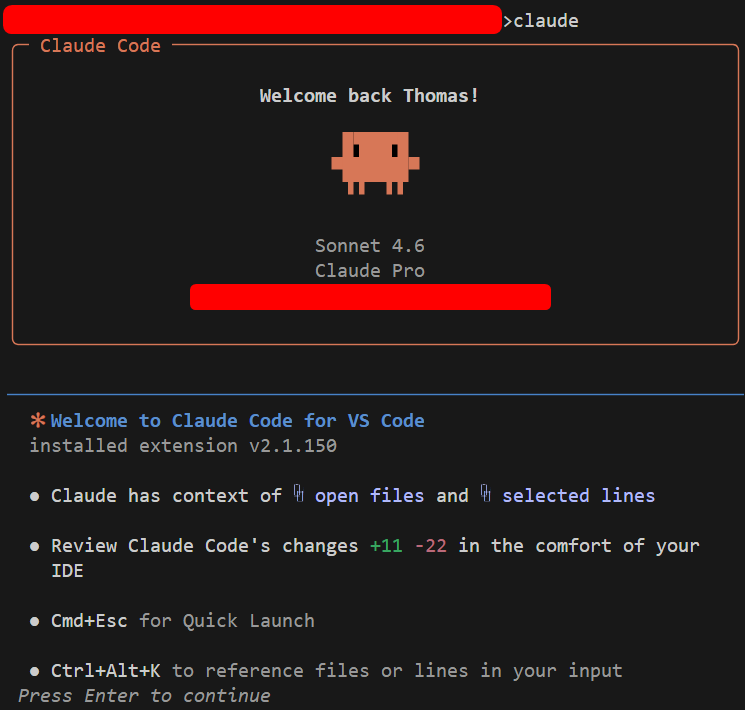
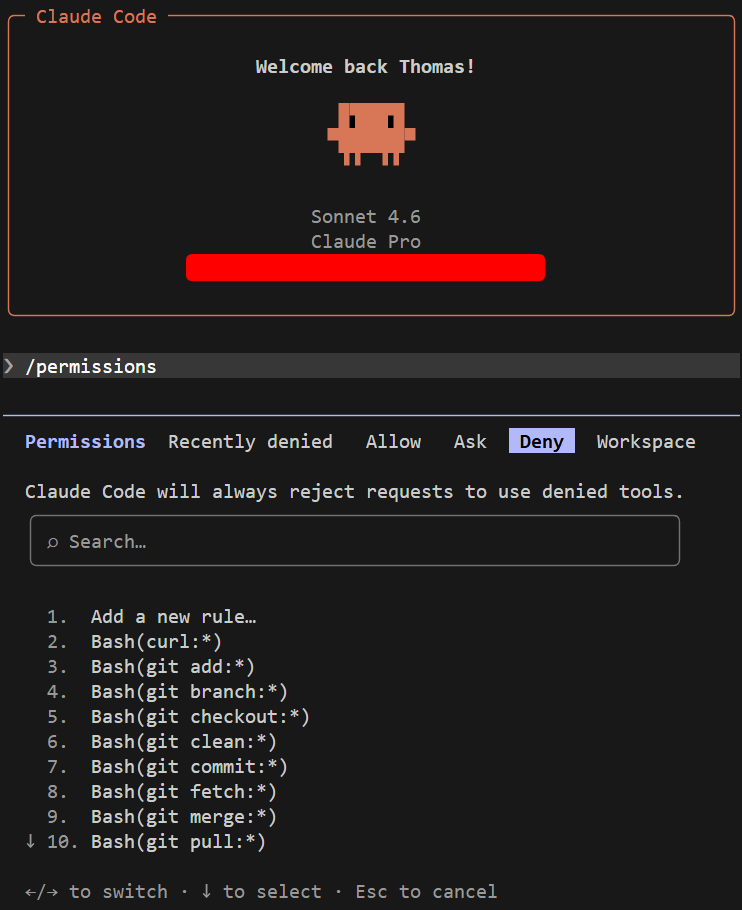

# Claude Code: Local Setup and Safe Workflow Guide

A practical guide for installing Claude Code on Windows 11, configuring it for **strict safety** (no `git` mutations, no silent file changes) and **running it locally scoped only to the workspace you launch** it from.

> **Goal of this setup:** Claude reads and proposes, you decide. No commits, no pushes, no auto-edits. Every change is shown as a `diff` before it touches disk.


## 1. Install Claude Code

### 1.1 Install Node.js

Visit [https://nodejs.org/en](https://nodejs.org/en) and download the LTS installer. Once installed, verify it from a new terminal:

```powershell
node -v
```

In Linux you can try this:
```
curl -o- https://raw.githubusercontent.com/nvm-sh/nvm/v0.40.1/install.sh | bash
```
**Close and reopen the terminal** and run:
```
nvm install --lts
```

You should see something like `v24.16.0`.

### 1.2 Install the Claude Code Agent

```powershell
npm install -g @anthropic-ai/claude-code
```

Expected output:

```
added 2 packages in 6s
npm notice New minor version of npm available! ...
npm notice Changelog: ...
npm notice To update run: ...
npm notice
```

### 1.3 First launch (ONLY to generate config files)

For safety, navigate to an empty repo folder and open any terminal to run the next command. **Avoid running it from `C:\Users\<user>` in Windows or `~` in Linux**.

```powershell
claude
```



Since now, we just want to **generate the configuration files**,when prompted `"Is this a project you created or one you trust?"`, **pick `2. No, exit`**. Especially for cases when you mistakenly opened the terminal from the home directory `C:\Users\<user>`, this is a very critical step for the beginning! We do *not* want to trust our entire user profile. It contains SSH keys (e.g., `.ssh` folder), credentials, application data (e.g., `.VirtualBox` or `.vscode` folder) and more.

*This first run still creates the config files we need*.








## 2. Verify the generated configuration files

Under `C:\Users\<user>` on Windows or `~` on Linux/macOS, we should now see:

- `.claude.json`: A file that **tracks trusted folders and account state**.
- `.claude\`: A folder containing the configuration file `settings.json`, credentials and cache data.



Open `.claude\settings.json`. Initially, it will contain just `{ "theme": "dark" }` or a similar minimal content. We'll fill it in next.


## 3. Configure user-level security rules

Edit `C:\Users\<user>\.claude\settings.json` and replace its contents with the following. These rules apply to **every Claude Code session we will ever launch** - for any future repository/folder.

```json
{
  "permissions": {
    "allow": [
      "Read",
      "Glob",
      "Grep",
      "Bash(git status)",
      "Bash(git diff)",
      "Bash(git diff:*)",
      "Bash(git log:*)",
      "Bash(git show:*)",
      "Bash(ls:*)",
      "Bash(cat:*)"
    ],
    "deny": [
      "Bash(git add:*)",
      "Bash(git commit:*)",
      "Bash(git push:*)",
      "Bash(git reset:*)",
      "Bash(git checkout:*)",
      "Bash(git restore:*)",
      "Bash(git stash:*)",
      "Bash(git rebase:*)",
      "Bash(git merge:*)",
      "Bash(git pull:*)",
      "Bash(git fetch:*)",
      "Bash(git clean:*)",
      "Bash(git branch:*)",
      "Bash(git switch:*)",
      "Bash(git tag:*)",
      "Bash(rm -rf:*)",
      "Bash(sudo:*)",
      "Bash(curl:*)",
      "Bash(wget:*)",
      "Bash(ssh:*)",
      "Read(./.env)",
      "Read(./.env.*)",
      "Read(./secrets/**)",
      "Write(./.git/**)",
      "Edit(./.git/**)",
      "Read(~/.ssh/**)",
      "Read(~/.aws/**)",
      "Read(~/.gnupg/**)",
      "Read(~/.gitconfig)",
      "Read(~/.docker/**)",
      "Read(~/.vscode/**)",
      "Read(~/OneDrive/**)",
      "Read(~/.credentials.json)",
      "Read(~/.claude/.credentials.json)"
    ],
    "ask": [
      "Write",
      "Edit",
      "Bash"
    ],
    "defaultMode": "default"
  },
  "theme": "dark"
}
```

### 3.1 Security settings explanation

| Block | Effect |
|---|---|
| `deny` | Hard-blocked. Claude cannot run these even if it tries. Covers all `git` mutations, destructive commands and sensitive file reads. |
| `allow` | Pre-approved **read-only** inspection commands and `git` commands that can run silently in the background. |
| `ask` | Prompts you every time. Write/Edit/Bash all require a "Yes"/"No" `diff` confirmation by the user. |

Precedence: **deny > allow > ask > defaultMode**. First match wins.

---

## 4. Per-project behavior rules — `CLAUDE.md`

The config file `settings.json` is the hard wall. However, each project requires a `CLAUDE.md` which contains the instruction manual Claude reads at startup. Create this file at the **root of each repo** you work in. For instance, here we have `C:\Users\<user>\Documents\GH_repos\<MyRepo>`.

`CLAUDE.md`:

```markdown
# Project rules for Claude Code

## 1. Git: The Absolute Boundary
* I must **manage `git` entirely on my own**. You must **NEVER** run `git add`, `git commit`, `git push`, `git pull`, `git checkout`, `git reset`, `git stash`, `git rebase`, `git merge`, `git branch`, `git switch`, or any other command that modifies repository state or working tree via git. So, no `git`-related commands for you.
* Read-only `git` inspection (`git status`, `git diff`, `git log`, `git show`) is allowed for you, mainly when needed for context.
* Do not suggest commit messages or PR descriptions unless I explicitly ask.
* *Summary*: I must retain **full control of `git`**, so you (the agent) must never run any `git` command that modifies the repository state.

## 2. Change workflow: Always Keep Me In The Loop
* Before writing or editing ANY file, **describe in plain text**:
   - Which files you intend to modify?
   - What the change does?
   - Why is the change needed?
   - Are there any side effects or files that might also need changes later?
* Wait for my explicit `"Go Ahead"` approval before making the edit.
* Make ONE logical change at a time. Do not batch unrelated edits.
* After each accepted edit, give me a **one-line summary of what changed**.
* Never run formatters, linters or test commands without asking me first.
* *Summary*: Before editing any file, you (the agent) must describe the planned change and wait for my explicit `"Go Ahead"` approval with one logical change at a time.

## 3. Scope Discipline
* Touch only files directly **related to the task** I described.
* If you think a change requires editing files outside the obvious scope, you must STOP and ASK me.
* Do not refactor "while you're in there." **Do not rename things I didn't ask to rename**.
* *Summary*: You must stay strictly within the scope of the requested task.

## 4. When Unsure
* Ask! Never guess! Never invent file paths, API names, or library functions!
* *Summary*: You must ask rather than guess when anything is unclear.
```


## 5. Run Claude scoped to a single workspace

> ⚠️ **Key rule:** Claude's workspace = the directory from which you ran the command `claude`. Always launch it from *inside* the specific repo you want to work on. Never from `C:\`, your Desktop or your home directory!

```powershell
# Change Directory
cd C:\Users\<user>\Documents\GH_repos\<MyRepo>

# Run Claude Code Agent
claude
```



On first launch in a new folder, you'll get the trust prompt we saw before. **This time pick `1. Yes, I trust this folder`, because now the scope is just that one repo**!

After this, the welcome screen shows the active workspace path (e.g. `~\Documents\GH_repos\<MyRepo>`) and your model (e.g., `Sonnet 4.6` on Pro Plan).


## 6. Verify everything loaded correctly

### 6.1 Check permissions

After having typed `claude`, at the Claude prompt, type:

```
/permissions
```



Use the arrow keys `← →` to switch tabs:
- **Allow**: Should list your read-only commands.
- **Ask**: Should show `Write`, `Edit`, `Bash`.
- **Deny**: Should show all git mutations and sensitive reads.
- **Workspace**: Should show the current repo path, **not your home directory**.

Press `Esc` to close.

### 6.2 Test the safety wall

Try this in the prompt:

```
Run `git status` and then `git add .`
```

`git status` should run silently (allow list). `git add .` should be **hard-denied**. Claude can't even ask for permission. That's the deny rule working.


## 7. Audit which folders Claude has access to

Claude stores **trusted folders in `~/.claude.json` under the `projects` JSON key/field**. You can list them anytime.

### Windows (PowerShell)

```powershell
(Get-Content $HOME\.claude.json -Raw | ConvertFrom-Json).projects.PSObject.Properties.Name
```

We can also make it a permanent command named `claude-dirs`! Add it to your **PowerShell profile**, so `claude-dirs` works from anywhere:
```powershell
notepad $PROFILE
```

Say `"yes"` if it offers to create the file in case it does not exist until now. Paste in:
```powershell
function claude-dirs {
    (Get-Content $HOME\.claude.json -Raw | ConvertFrom-Json).projects.PSObject.Properties.Name
}
```
Open a new terminal or reload by runnring `. $PROFILE`. Now, we can run `claude-dirs` anytime from anywhere.

### Linux / macOS (with `jq` installed)

```bash
jq -r '.projects | keys[]' ~/.claude.json
```
Add to `~/.bashrc` or `~/.zshrc`:
```bash
alias claude-dirs='jq -r ".projects | keys[]" ~/.claude.json'
```

For both cases, we should see only the repo folders we have intentionally trusted, here:

```
C:\Users\thoma\Documents\GH_repos\<MyRepo>
```

> ⚠️ **Attention:** If you ever see the bare home directory `C:\Users\<user>` or even `C:\` listed, open `.claude.json` and **remove that entry**. This means Claude has scope over your entire profile, which is **very dangerous**!.


## 8. Daily workflow

1. **`cd` into the repo**, then `claude`.
2. **Start in Plan mode** for anything non-trivial. Press **Shift+Tab** until you see `plan mode on`. Claude can read everything but can't write. Describe the task, get a written plan.
3. Review the plan. Refine or accept.
4. **Shift+Tab back to normal mode** and tell Claude to proceed.
5. For each edit, Claude shows a **`diff`** and waits. Pick:
   - ✅ **Yes**: Apply this one change.
   - ❌ **No, with feedback**: Reject and tell Claude what to do differently
   - ⚠️ **Yes, don't ask again**: **Avoid this, since it breaks the "always in the loop" rule**.
6. When satisfied with a batch of changes, **leave Claude idle** and run `git diff`, `git add .`, `git commit` yourself in a second terminal.

### 8.1 Useful keys and commands

| Key / Command | Action |
|---|---|
| **Shift+Tab** | Cycle: normal → auto-accept → plan mode |
| **Esc** | Cancel Claude mid-response |
| **Esc Esc** | Rewind to a previous message |
| **Ctrl+C** | Exit session |
| `/permissions` | View/edit live rules |
| `/help` | List all commands |
| `/clear` | Reset context |
| `/compact` | Summarize history to free up tokens |
| `/model` | Switch model (e.g. to Opus) |
| `/cost` | Token usage this session |
| `/exit` | Quit |


## 9. Safety checklist

Before starting real work, confirm that:

- Node.js is installed with `node --version` and `claude --version` works too.
- `~/.claude/settings.json` contains the **deny/ask/allow blocks**.
- **Home directory is NOT in trusted projects**, so we should NOT see `C:\Users\<you>`.
- Each repo we work in has a `CLAUDE.md` at the root
- We launch `claude` *only from inside* a specific repo, never from home.
- `/permissions` inside the session shows the rules loaded.
- Test confirmed: `git status` runs silently, but `git add .` is denied. 


## 10. Never use

- `--dangerously-skip-permissions` flag
- `"Yes, don't ask again"` on edit prompts, because it silently grows your allow list!
- Launching `claude` from `C:\`, `~`, `Desktop`, or `Downloads`.

**We are set**, since:
* The hard wall (`settings.json` deny) blocks dangerous operations.
* The behavioral layer (`CLAUDE.md` instructions) keeps Claude polite and in-scope.
*  The workspace scoping (`cd` then `claude`) limits what the agent can even see.
