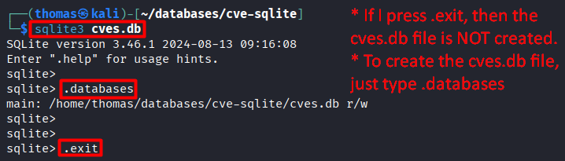
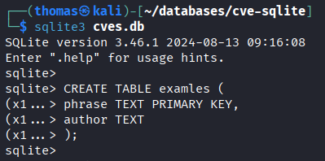
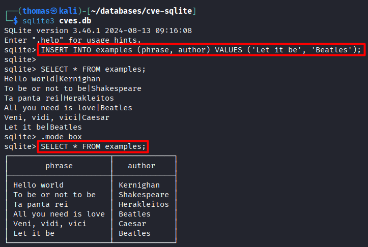
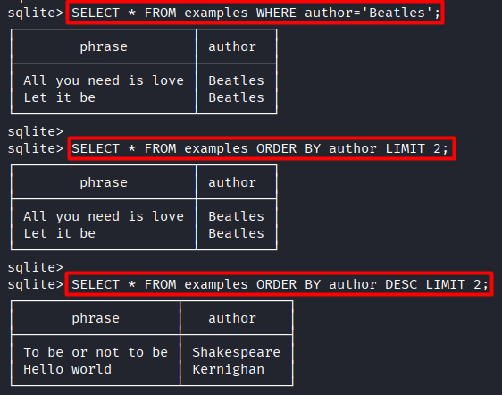
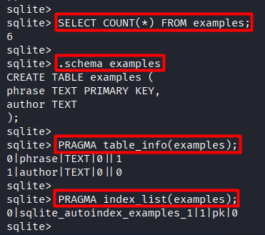

# SQLite Cheatsheet

A practical reference built around a **local `cves.db` file**, with:
* `sqlite3` Shell commands
* Python equivalents and
* An optional Docker setup at the end.


## 1. SQLite Shell Operations

SQLite is fundamentally different from PostgreSQL, MySQL and MongoDB. *It is NOT a server, it is a library. There is NO daemon process, no port to expose, no network protocol*. **The database is literally one `.db` file and `sqlite3` (CLI or Python module) opens it directly**. Putting that in a Docker container would add layers without giving you anything.

### 1.1 Install and create the database

```bash
sudo apt install sqlite3                 # One-time install
mkdir -p ~/databases/cve-sqlite          # Working directory
cd ~/databases/cve-sqlite
sqlite3 cves.db                          # Opens the SQLite shell
```

You'll get a `sqlite>` prompt.

**Worth knowing:** Running `sqlite3 cves.db` and immediately typing `.exit` does **not** create the file. SQLite only writes the file once **something actually touches the database**. Run `.databases` (or any `CREATE TABLE`, `PRAGMA`) first to force the file into existence:
```
sqlite> .databases
sqlite> .exit
```



Now `ls` will show `cves.db` on disk.

### 1.2 Recommended session setup

Every time you open the shell, set:

```
.mode box
.headers on
```

This gives you bordered tables with column names, which is much more readable than the default pipe-delimited output.

### 1.3 Meta-commands reference

Meta-commands start with `.` and have **no semicolon at the end**. They are shell built-ins, not SQL.

| Command | What it does |
|---|---|
| `.help` | List all meta-commands |
| `.databases` | Show attached database files and forces `.db` file creation on the first use |
| `.tables` | List all tables |
| `.schema` | Show `CREATE` statements for *every table* |
| `.schema <table>` | Show `CREATE` statement for *a specific table* |
| `.indexes <table>` | Show indexes on *a apecific table* |
| `.mode box` / `.mode column` / `.mode csv` | Output formatting |
| `.headers on` / `.headers off` | Toggle column names in output |
| `.dump` | Print full DB as SQL (text backup) |
| `.backup backup.db` | Binary backup of the DB |
| `.width 15 40 8` | Set column widths (per column, in order) |
| `.read script.sql` | Execute SQL from a file |
| `.quit` or `.exit` | Leave the shell |

### 1.4 Create a table

```sql
CREATE TABLE examples (
    phrase TEXT PRIMARY KEY,
    author TEXT
);
```

Verify it landed:
```sql
.tables
.schema examples
```



### 1.5 Insert table rows

```sql
INSERT INTO examples (phrase, author) VALUES ('Hello world', 'Brian Kernighan');
INSERT INTO examples (phrase, author) VALUES ('To be or not to be', 'W. Shakespeare');
INSERT INTO examples (phrase, author) VALUES ('I think therefore I am', 'Descartes');
```



### 1.6 Select / query

```sql
SELECT * FROM examples;
SELECT COUNT(*) FROM examples;
SELECT phrase FROM examples WHERE author = 'Shakespeare';
SELECT * FROM examples WHERE phrase LIKE '%world%';
SELECT * FROM examples ORDER BY author LIMIT 5;
```



### 1.7 Update

```sql
UPDATE examples SET author = 'Shakespeare' WHERE author = 'W. Shakespeare';
UPDATE examples SET phrase = 'Hello world!' WHERE phrase = 'Hello world';
```

Confirm with `SELECT * FROM examples;`.

### 1.8 Delete

```sql
DELETE FROM examples WHERE phrase = 'Hello world!';
DELETE FROM examples;                    -- Empties the table, but keeps the schema
```

### 1.9 Drop the table

```sql
DROP TABLE examples;
DROP TABLE IF EXISTS examples;           -- Safer, no error if it doesn't exist
```

### 1.10 Upsert (insert-or-update)

```sql
INSERT INTO examples (phrase, author) VALUES ('Hello world', 'Kernighan')
ON CONFLICT(phrase) DO UPDATE SET author = excluded.author;
```

`excluded` is a virtual table holding the row you tried to insert. It is used inside `ON CONFLICT` to refer to the new conflicting values.

### 1.11 Inspection queries

```sql
-- Row count
SELECT COUNT(*) FROM examples;

-- All user tables
SELECT name FROM sqlite_master WHERE type='table';

-- Columns of a table with types
PRAGMA table_info(examples);

-- Indexes on a table
PRAGMA index_list(examples);
```



### 1.12 Type quirks

- **No `BOOLEAN`**: Use `INTEGER` with `0` / `1`.
- **No `TIMESTAMP`**: Use `TEXT` (ISO 8601 strings) or `INTEGER` (Unix epoch). Text is more readable.
- **Dynamic typing**: Unless you use `STRICT` tables, declared types are hints, not enforced. However, stick to the declared types to avoid surprises.
- **JSON**: Store as `TEXT` and query with the built-in `json_*()` functions.

### 1.13 Querying JSON stored as TEXT

```sql
-- Suppose the column 'urls' holds the value '["url1","url2","url3"]'
SELECT phrase, json_array_length(urls) AS num_urls FROM examples;
SELECT phrase, json_extract(urls, '$[0]') AS first_url FROM examples;
```

### 1.14 Running SQL from a file

```bash
cat > setup.sql <<'EOF'
CREATE TABLE IF NOT EXISTS examples (phrase TEXT PRIMARY KEY, author TEXT);
INSERT INTO examples VALUES ('Hello world', 'Kernighan');
EOF

sqlite3 ~/databases/cve-sqlite/cves.db ".read setup.sql"
```

### 1.15 One-shot commands (no interactive shell)

Useful for scripting and quick checks:
```bash
sqlite3 ~/databases/cve-sqlite/cves.db ".tables"
sqlite3 ~/databases/cve-sqlite/cves.db "SELECT COUNT(*) FROM examples;"
wc -l ~/databases/cve-sqlite/cves.db
```


## 2. SQLite from Python

**`sqlite3` is part of the Python standard library, so no install is needed**. The same `cves.db` file is opened directly with the command `conn = sqlite3.connect("...")`.

### 2.1 Minimal script

**SQLite auto-creates the `.db` file but NOT missing (parent) folders**. To ensure that you will not get the error `sqlite3.OperationalError: unable to open database file`, you should also write `from pathlib import Path`.

```python
import sqlite3
from pathlib import Path

# Create parent directories if not exist and open the DB file
Path("/home/thomas/databases/cve-sqlite").mkdir(parents=True, exist_ok=True)
conn = sqlite3.connect("/home/thomas/databases/cve-sqlite/cves.db")
cur = conn.cursor()

SQL1_create = """
CREATE TABLE IF NOT EXISTS demo (
    id INTEGER PRIMARY KEY,
    name TEXT,
    score REAL
);
"""
SQL2_insert = """
INSERT INTO demo (name, score) VALUES (?, ?)
"""
SQL3_select = """
SELECT name, score FROM demo ORDER BY score DESC
"""

rows = [
    ("Bob", 8.1),
    ("Carol", 9.7),
    ("Dave", 7.6),
]

cur.execute(SQL1_create)
cur.execute(SQL2_insert, ("Alice", 9.5))
cur.executemany(SQL2_insert, rows)
conn.commit()           # To commit the DB changes performed during this connection

for row in cur.execute(SQL3_select):
    print(row)
conn.close()
```


### 2.2 Idioms worth knowing

**Always use PLACEHOLDERS (`?`) and NOT string formatting, because of an SQL injection threat:**
```python
# BAD: SQL injection due to the ' character
cur.execute(f"SELECT * FROM demo WHERE name = '{name}'")

# GOOD: Positional
cur.execute("SELECT * FROM demo WHERE name = ?", (name,))

# GOOD: Named (better for many columns)
cur.execute("SELECT * FROM demo WHERE name = :n", {"n": name})
```

**Context manager for automatic transactions:**
```python
with sqlite3.connect(DB_PATH) as conn:
    conn.execute("INSERT INTO demo (name, score) VALUES (?, ?)", ("Eve", 9.0))
# auto-commits on success, rolls back on exception
```

**Row factory for dict-like access:**
```python
conn = sqlite3.connect(DB_PATH)
conn.row_factory = sqlite3.Row
row = conn.execute("SELECT * FROM demo LIMIT 1").fetchone()
print(row["name"], row["score"])
```

**Fetch helpers:**
```python
# Create a cursor to iterate all selected rows
cur.execute("SELECT * FROM demo")
cur.fetchone()       # Next row or None
cur.fetchmany(10)    # Next 10 rows
cur.fetchall()       # All remaining rows
```

**Upsert from Python:**
```python
SQL_upsert = """
INSERT INTO demo (name, score) VALUES (?, ?)
ON CONFLICT(name) DO UPDATE SET score = excluded.score
"""
conn.execute(SQL_upsert, ("Alice", 9.9))
```

**Check if a table exists:**
```python
SQL_exists = """
SELECT name FROM sqlite_master WHERE type='table' AND name=?
"""
exists = conn.execute(SQL_exists, ("demo",)).fetchone()
```

**Count rows:**
```python
num_rows = conn.execute("SELECT COUNT(*) FROM demo").fetchone()[0]
```

### 2.3 Cleaning a database

```python
import sqlite3
from pathlib import Path


def clean_db(db_path: str, mode: str = "rows"):
    """
    mode:
      'rows'   - DELETE all rows from every user table (keep schema)
      'tables' - DROP every user table (keep file)
      'file'   - Delete the .db file entirely
      'vacuum' - Reclaim free space after big deletes
    """
    path = Path(db_path)

    if mode == "file":
        for suffix in ("", "-wal", "-shm", "-journal"):
            Path(str(path) + suffix).unlink(missing_ok=True)
        return

    if not path.exists():
        return

    conn = sqlite3.connect(path)
    try:
        if mode == "vacuum":
            conn.execute("VACUUM;")
            return

        tables = [
            r[0] for r in conn.execute(
                "SELECT name FROM sqlite_master "
                "WHERE type='table' AND name NOT LIKE 'sqlite_%';"
            )
        ]
        with conn:
            for t in tables:
                if mode == "rows":
                    conn.execute(f"DELETE FROM {t};")
                elif mode == "tables":
                    conn.execute(f"DROP TABLE IF EXISTS {t};")
    finally:
        conn.close()
```

### 2.4 Verifying from the shell after Python writes

```bash
sqlite3 ~/databases/cve-sqlite/cves.db ".tables"
sqlite3 ~/databases/cve-sqlite/cves.db "SELECT COUNT(*) FROM demo;"
```

### 2.5 Operations equivalence table

| Operation | Shell | Python |
|---|---|---|
| List tables | `.tables` | `SELECT name FROM sqlite_master WHERE type='table';` |
| Show schema | `.schema demo` | `SELECT sql FROM sqlite_master WHERE name='demo';` |
| Column info | `PRAGMA table_info(demo);` | `conn.execute("PRAGMA table_info(demo)").fetchall()` |
| Insert | `INSERT INTO demo VALUES (...);` | `conn.execute("INSERT INTO demo VALUES (?, ?)", (...))` |
| Commit | (auto per statement) | `conn.commit()` or `with conn:` |
| Upsert | `ON CONFLICT(col) DO UPDATE SET ...` | same SQL, via `conn.execute()` |
| Count | `SELECT COUNT(*) FROM demo;` | `num_rows = conn.execute("SELECT COUNT(*) FROM demo").fetchone()[0]` |
| Quit | `.quit` | `conn.close()` |

---

## 3. SQLite Docker Container

An SQLite Docker container is **not necessary**. SQLite is a library, not a server. A plain `.db` file on the host works perfectly. Keep this section only if you want the DB to live alongside other Dockerized services, or if you need a consistent environment across machines.

### 3.1 Run the container

```bash
docker run -d \
  --name cve-sqlite \
  --user root \
  --restart always \
  -v ~/databases/cve-sqlite:/data \
  -w /data \
  --entrypoint sleep \
  keinos/sqlite3 \
  infinity
```

Key flags:
- `--user root`: Required for write permissions on `/data`
- `--restart always`: Comes back after host reboot or Docker restart
- `-v ~/databases/cve-sqlite:/data`: **Bind mount** = the same `cves.db` is shared between host and container, fully bidirectional
- `--entrypoint sleep infinity`: keeps the container alive so you can `docker exec` into it on demand

### 3.2 Verify

```bash
docker ps       # cve-sqlite should be "Up"
docker inspect -f '{{.HostConfig.RestartPolicy.Name}}' cve-sqlite   # Always
docker exec -it cve-sqlite sqlite3 /data/cves.db
```

### 3.3 Notes

- **Same file, two views**: The file `~/databases/cve-sqlite/cves.db` on the host *is* `/data/cves.db` in the container. Edits from either side are visible to the other instantly.
- **Avoid concurrent writes**: Host Python + container shell both writing at once will trigger `database is locked`. Reads are fine. For concurrent-read workloads enable WAL once: `PRAGMA journal_mode=WAL;`.
- **Backspace doesn't work in the Docker container shell**: The `keinos/sqlite3` image lacks readline. Either install `rlwrap` on the host (`rlwrap docker exec -it cve-sqlite sqlite3 /data/cves.db`) or just use the host-installed `sqlite3` from section 1 against the same file.

---

## 4. Troubleshooting

> **`unable to open database file`**
Parent directory doesn't exist. Create it first with `mkdir -p` on the shell or with `Path(...).mkdir(parents=True, exist_ok=True)` in Python.

> **File not created after running `sqlite3 cves.db` and typing `.exit`**
SQLite only writes the file once something touches the DB. First, run `.databases` or any `CREATE`/`PRAGMA` command before typing `.exit`.

> **Garbled characters when typing (`^H^H`, `^C^C`)**
The `sqlite3` build in the Docker image has no readline! Use the host CLI instead, or wrap with `rlwrap`.

> **Changes "disappear" between sessions in Python**
You forgot to include `conn.commit()` or didn't use `with conn:` at all. SQLite Python doesn't autocommit by default.

> **`database is locked`**
Another connection is holding a write lock. Close other shells / scripts, or enable WAL mode: `PRAGMA journal_mode=WAL;`.

> **File seems huge after deleting rows**
SQLite reuses freed pages but doesn't shrink the file. Run `VACUUM;` to physically reclaim space.