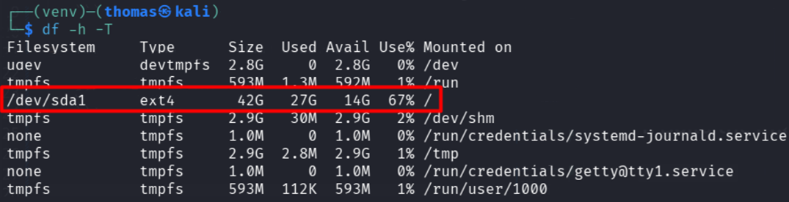

# Commands to check disk size

```
df -T                                       # Filesystem type
df -h -T                                    # Human-readable + filesystem type
df -BG                                      # Force everything in GB
duf                                         # Colored, aligned, nicest output (requires apt install duf)
ncdu /                                      # Interactive, drill-down by folder
lsblk -o NAME,SIZE,FSTYPE,MOUNTPOINT        # Block device tree view
```

# Command `df -h -T`

